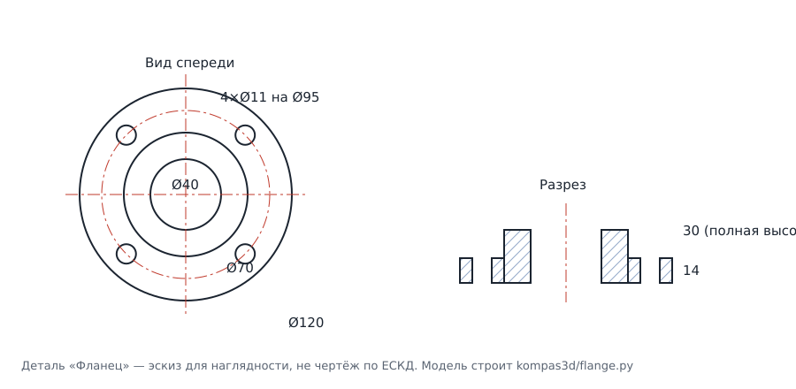

# Деталь «Фланец» для КОМПАС-3D

`flange.py` строит деталь в КОМПАС-3D автоматически, через COM-API: создаёт
новый документ-деталь, четыре эскиза и четыре операции, обновляет модель и
сохраняет её в `.m3d`.



## Что получается

| Элемент | Размер по умолчанию |
|---|---|
| Наружный диаметр плиты | Ø120 мм |
| Толщина плиты | 14 мм |
| Диаметр бобышки | Ø70 мм |
| Высота бобышки над плитой | 16 мм (полная высота детали 30 мм) |
| Центральное отверстие | Ø40 мм насквозь |
| Крепёжные отверстия | 4 × Ø11 мм на окружности Ø95 мм |

## Как запустить

Нужен Windows с установленным КОМПАС-3D и Python **той же разрядности**, что и
КОМПАС (обычно 64-бит).

```
pip install pywin32
python flange.py
```

КОМПАС запустится сам, деталь построится на глазах и сохранится в `flange.m3d`
рядом со скриптом.

## Свои размеры

Все размеры — параметры командной строки, менять файл не нужно:

```
python flange.py --d-outer 160 --d-hub 90 --d-bore 55 ^
                 --plate 18 --hub 22 ^
                 --bolt-circle 130 --bolt-d 14 --bolt-count 6 ^
                 --out C:\Temp\flange_160.m3d
```

Полный список: `python flange.py --help`. Некорректные сочетания (отверстия
вылезают за край плиты, расточка больше бобышки и т.п.) скрипт отсекает до
запуска КОМПАСа.

Ещё флаги: `--hidden` — строить без показа окна, `--close` — закрыть документ
после сохранения, `--name` — имя детали в дереве модели.

## Как построено (и как повторить руками)

Все эскизы лежат на одной плоскости XY — так не приходится выбирать грани,
и скрипт не ломается от изменения размеров.

1. **Плита.** Эскиз на плоскости XY: окружность Ø120 из центра.
   Операция *Элемент выдавливания*, на расстояние 14 мм.
2. **Бобышка.** Ещё один эскиз на XY: окружность Ø70.
   *Элемент выдавливания* на 30 мм (14 плиты + 16 сверху) — он прорастает
   сквозь плиту и объединяется с ней.
3. **Центральное отверстие.** Эскиз на XY: окружность Ø40.
   *Вырезать выдавливанием*, «через всё» в обе стороны.
4. **Крепёжные отверстия.** Эскиз на XY: четыре окружности Ø11, центры на
   окружности Ø95 под углами 45°, 135°, 225°, 315°.
   *Вырезать выдавливанием*, «через всё» в обе стороны.

## Если не работает

* `Нужен pywin32 ...` — не установлен `pywin32` либо скрипт запущен не в Windows.
* `Класс не зарегистрирован` / ошибка `Dispatch` — КОМПАС ни разу не запускался
  после установки. Запустите его один раз вручную (при необходимости — от имени
  администратора), чтобы COM-сервер зарегистрировался.
* Ошибка при `EnsureModule` — Python другой разрядности, чем КОМПАС.
  Поставьте 64-битный Python для 64-битного КОМПАСа.
* Скрипт написан на API5 (`Kompas.Application.5`) — этот интерфейс поддерживают
  и современные версии КОМПАС-3D (v18–v23).
